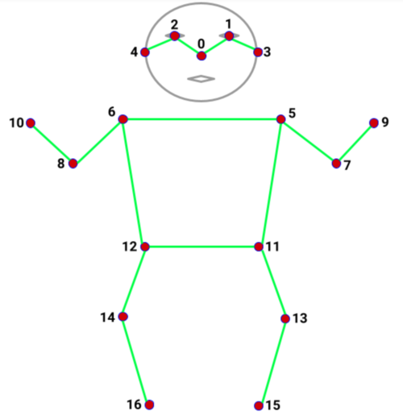
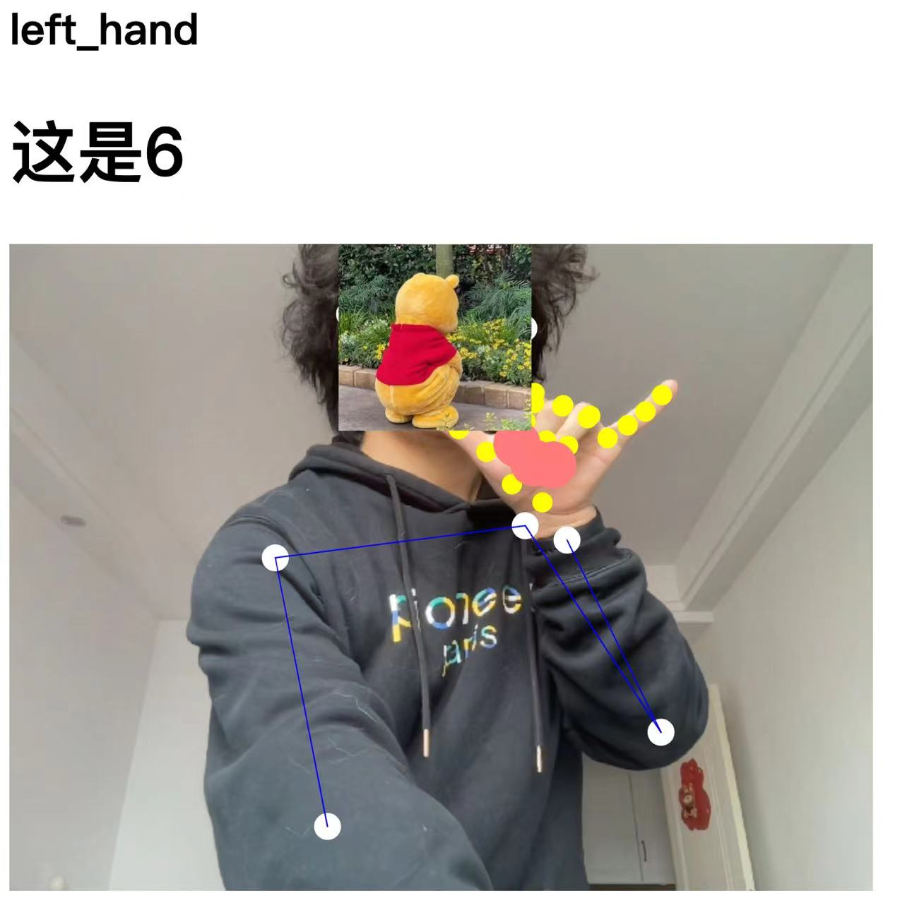

# Pose-Detection Demos in Web

**Author : Primo**

这个包内收集了一些最新的浏览器端实时姿态检测demo。

*Hint:因为包内的模型大多是谷歌发布，可能很多情况下需要梯子来保证模型的正常运行*

在开始使用模型之前，我们需要对浏览器端姿态检测的基本原理有一些认知。

首先，这个包里所有的姿态检测都基于机器学习。简单来说，机器学习是一种教会
计算机如何理解一些东西的过程。给计算机输入大量的数据，告诉它1是1，2是2。通常我们需要很多很多的
数据才能让计算机学会一些东西。我们把这些数据叫做"数据集"。就拿姿态检测为例，我们将成千上万张
含有人类的照片做成数据集，在每张照片上标注人的各个节点，比如眼睛、肩膀等。然后计算机接受数据，
通过机器学习算法来"学习"如何在图片中把人识别出来。当计算机学会了"识别"之后，拿一张图片给计算机
，它大概率能够识别出图片中人的各个关键节点。


<div align="center">

</div>

如今，我们已经有了很多框架来搭建机器学习模型。
由谷歌发布的**Tensorflow**和脸书发布的**Pytorch**是
当今两个最主流的框架。它们都基于Python实现，需要有一定的
深度学习算法基础和Python编程技巧才能驾驭。
但是对于数字艺术创作者/游戏创作者/软件工程师（尤其是前端工程师），
我们很多人没有非常深厚的数学基础和Python编程经验，所以这些平台对
很多开发者来说，还是有非常陡峭的学习曲线。

为了使得机器学习对开发者来说更容易上手，谷歌发布了一个Javascript库——
Tensorflow.js。它使得机器学习的算法和模型可以以Javascript语言来实现。
随着Node.js的不断完善，这让机器学习可以在浏览器端和Web后端都得到了用武之地。
因为Web端的特性，我们几乎可以在所有设备上都使用到这些成果。就像React的宣传语一样
，浏览器端的机器学习也可以做到"一次编写，随处使用"。

为了进一步让初学者体验到机器学习的魔力与乐趣，ML5.js应运而生。它是基于Tensorflow.js开发的，将一些常用的模型
进行了封装，以方便初学者更好地学会调用这些模型。从ML5.js的名字就可以看出，它和P5.js(processing的javascript库）有着高度的关联性。
这两者都是为对数字艺术感兴趣的编程初学者设计的。有了这两个库作支撑，我们可以用非常简短的代码实现很多非常炫酷的功能。


### 01-Posenet in P5.js

Tensorflow.js提供了三种已经训练好的姿态检测模型供我们使用。
他们分别是**MoveNet**，**Blazepose**以及**Posenet**。
他们是谷歌不同的研发团队开发的。在ML5.js中，使用到的是**Posenet**模型。

**Posenet**是通过<a href="https://paperswithcode.com/dataset/coco">"COCO"</a>((Microsoft Common Objects in Context))数据集
训练而成的。COCO是一个超大规模的图片数据集，拥有超过数十万张照片。
在**Posenet**和**MoveNet**中，我们得到的人体关键点也被称为COCO节点，它共有17个。


<div align="center">
    
</div>

这17个节点会按照如下的顺序存放在一个数组中。
```json
0: nose
1: left_eye
2: right_eye
3: left_ear
4: right_ear
5: left_shoulder
6: right_shoulder
7: left_elbow
8: right_elbow
9: left_wrist
10: right_wrist
11: left_hip
12: right_hip
13: left_knee
14: right_knee
15: left_ankle
16: right_ankle
```

在ML5.js中，一旦我们在视频或者图片中检测出了人体姿态。
我们就会从服务器端得到一个对象类型。首先，这个对象类型拥有一个
"置信度"（学过统计学的同学们应该都理解），代表识别出的这坨东西
"是人体"的概率。随之而来的是一个名叫"keypoints"的数组，上面的17个
关键节点被依次存放在这个数组里。数组里的每一个点同样拥有一个置信度。
每一个点还有一个'part'，代表其标注的位置。然后就是一个坐标[x,y]，代表
这个点在你输入的二维平面上的真实坐标。（这和Blazepose中的坐标意义不一样）。
除开这个数组，每一个节点也都直接作为这个对象的"儿子"存放在这个对象中。
所以如果你需要了解鼻子的x坐标位置，你可以直接调用let x=pose.nose.x。

Posenet可以在同一张图片中识别多个人体，尽管它不太稳定（比如抖动很严重），但它还是
可以运用到很多不复杂的应用中。

下面是我截取的Posenet运行中的一瞬间的对象参数。
```json
{
    "score": 0.36062840477782576,
    "keypoints": [
        {
            "score": 0.9998100399971008,
            "part": "nose",
            "position": {
                "x": 304.9208122283104,
                "y": 309.5389037373465
            }
        },
        {
            "score": 0.9993601441383362,
            "part": "leftEye",
            "position": {
                "x": 350.35096105434553,
                "y": 267.1330611529517
            }
        },
        {
            "score": 0.9985820055007935,
            "part": "rightEye",
            "position": {
                "x": 278.3887003367977,
                "y": 259.3134281143604
            }
        },
        {
            "score": 0.8186571002006531,
            "part": "leftEar",
            "position": {
                "x": 397.34817979864573,
                "y": 290.57919038408926
            }
        },
        {
            "score": 0.4284822642803192,
            "part": "rightEar",
            "position": {
                "x": 235.44428754873314,
                "y": 282.58995798311344
            }
        },
        {
            "score": 0.8433191776275635,
            "part": "leftShoulder",
            "position": {
                "x": 471.59480588445405,
                "y": 496.9624085185129
            }
        },
        {
            "score": 0.9728891253471375,
            "part": "rightShoulder",
            "position": {
                "x": 154.78833803406948,
                "y": 479.0577168594539
            }
        },
        {
            "score": 0.0226301196962595,
            "part": "leftElbow",
            "position": {
                "x": 529.4033742229299,
                "y": 585.576703854572
            }
        },
        {
            "score": 0.017581390216946602,
            "part": "rightElbow",
            "position": {
                "x": 34.78550595532132,
                "y": 580.9919186603234
            }
        },
        {
            "score": 0.0062744165770709515,
            "part": "leftWrist",
            "position": {
                "x": 512.406827577821,
                "y": 553.6286341448239
            }
        },
        {
            "score": 0.002704796614125371,
            "part": "rightWrist",
            "position": {
                "x": 76.06921570774182,
                "y": 557.3660603293185
            }
        },
        {
            "score": 0.00424220459535718,
            "part": "leftHip",
            "position": {
                "x": 398.1407143077034,
                "y": 564.717056927514
            }
        },
        {
            "score": 0.00541426008567214,
            "part": "rightHip",
            "position": {
                "x": 240.92917965543873,
                "y": 555.8058724607475
            }
        },
        {
            "score": 0.0022254108916968107,
            "part": "leftKnee",
            "position": {
                "x": 400.528016146055,
                "y": 551.4891182866078
            }
        },
        {
            "score": 0.0033826844301074743,
            "part": "rightKnee",
            "position": {
                "x": 184.80833773483099,
                "y": 543.0382065828672
            }
        },
        {
            "score": 0.002814995124936104,
            "part": "leftAnkle",
            "position": {
                "x": 386.2246680352475,
                "y": 550.1599762319127
            }
        },
        {
            "score": 0.002312745898962021,
            "part": "rightAnkle",
            "position": {
                "x": 152.1527099609375,
                "y": 543.721379974009
            }
        }
    ],
    "nose": {
        "x": 304.9208122283104,
        "y": 309.5389037373465,
        "confidence": 0.9998100399971008
    },
    "leftEye": {
        "x": 350.35096105434553,
        "y": 267.1330611529517,
        "confidence": 0.9993601441383362
    },
    "rightEye": {
        "x": 278.3887003367977,
        "y": 259.3134281143604,
        "confidence": 0.9985820055007935
    },
    "leftEar": {
        "x": 397.34817979864573,
        "y": 290.57919038408926,
        "confidence": 0.8186571002006531
    },
    "rightEar": {
        "x": 235.44428754873314,
        "y": 282.58995798311344,
        "confidence": 0.4284822642803192
    },
    "leftShoulder": {
        "x": 471.59480588445405,
        "y": 496.9624085185129,
        "confidence": 0.8433191776275635
    },
    "rightShoulder": {
        "x": 154.78833803406948,
        "y": 479.0577168594539,
        "confidence": 0.9728891253471375
    },
    "leftElbow": {
        "x": 529.4033742229299,
        "y": 585.576703854572,
        "confidence": 0.0226301196962595
    },
    "rightElbow": {
        "x": 34.78550595532132,
        "y": 580.9919186603234,
        "confidence": 0.017581390216946602
    },
    "leftWrist": {
        "x": 512.406827577821,
        "y": 553.6286341448239,
        "confidence": 0.0062744165770709515
    },
    "rightWrist": {
        "x": 76.06921570774182,
        "y": 557.3660603293185,
        "confidence": 0.002704796614125371
    },
    "leftHip": {
        "x": 398.1407143077034,
        "y": 564.717056927514,
        "confidence": 0.00424220459535718
    },
    "rightHip": {
        "x": 240.92917965543873,
        "y": 555.8058724607475,
        "confidence": 0.00541426008567214
    },
    "leftKnee": {
        "x": 400.528016146055,
        "y": 551.4891182866078,
        "confidence": 0.0022254108916968107
    },
    "rightKnee": {
        "x": 184.80833773483099,
        "y": 543.0382065828672,
        "confidence": 0.0033826844301074743
    },
    "leftAnkle": {
        "x": 386.2246680352475,
        "y": 550.1599762319127,
        "confidence": 0.002814995124936104
    },
    "rightAnkle": {
        "x": 152.1527099609375,
        "y": 543.721379974009,
        "confidence": 0.002312745898962021
    }
}
```

### 02-Handpose in P5.js
<div align="center">
    
</div>

Handpose是一款能识别手掌和手指骨骼参数的机器学习模型。它也被
封装在了ML5.js中。它最多可以识别一只手，提供了21个3D手关节节点参数。

<div align="center">
    
</div>

和**Posenet**一样，我们调用Handpose在图像或者视频中识别
到了手部数据后，我们也会从服务器端得到一个对象。
这个对象按顺序存放了如上图所示的21个节点信息。每一个节点包括[x,y]坐标信息，和**Posenet**相同
，还增加了一个z轴坐标信息，这样就可以将它理解成3D空间的识别。当手掌发生侧转时，z轴可以在骨骼绑定等
相关应用中发挥很大的用处。

除了上面这些数据外，对象还存储了一个叫"annotations"的对象。
它存放了每根手指和手掌的信息，所以如果你要查询大拇指的相关信息，可以调用
let thumb=object.annotations.thumb。

下面是我在Handpose运行时截取的一瞬间的对象参数。


```json
{
    "thumb": [
        [
            311.1474129357343,
            392.8839134580602,
            31.628944396972656
        ],
        [
            305.308736143059,
            365.20717624808134,
            40.958133697509766
        ],
        [
            296.55928350326406,
            344.6487949195921,
            42.178436279296875
        ],
        [
            289.09028835985714,
            321.9771320066599,
            41.17280578613281
        ]
    ],
    "indexFinger": [
        [
            351.26226986601506,
            315.317770126479,
            33.45431900024414
        ],
        [
            317.7573958881063,
            287.82946656887157,
            41.258514404296875
        ],
        [
            301.0551201111043,
            279.13742066547405,
            45.38811111450195
        ],
        [
            295.82737357654224,
            276.7010123385984,
            46.33940887451172
        ]
    ],
    "middleFinger": [
        [
            353.7122101313199,
            309.04347842173087,
            16.16316032409668
        ],
        [
            294.2536349253059,
            291.90549768414684,
            24.071781158447266
        ],
        [
            277.4029452280277,
            312.1420227467726,
            23.412212371826172
        ],
        [
            282.40719597599997,
            328.68568506297936,
            20.75050163269043
        ]
    ],
    "ringFinger": [
        [
            343.6278986695346,
            307.76669737200876,
            1.2318196296691895
        ],
        [
            281.3661445784785,
            301.97755074942916,
            9.658766746520996
        ],
        [
            269.26558032780065,
            333.03373573840565,
            8.836081504821777
        ],
        [
            278.37322912437753,
            350.7239374751061,
            4.151844024658203
        ]
    ],
    "pinky": [
        [
            327.2987480246994,
            307.3400266338206,
            -11.768608093261719
        ],
        [
            281.79613233056017,
            306.4856480945225,
            -2.7679641246795654
        ],
        [
            274.7228580919318,
            333.18432280186977,
            -1.2925504446029663
        ],
        [
            287.3491935974832,
            347.7520597512496,
            -4.416280746459961
        ]
    ],
    "palmBase": [
        [
            333.42525789734873,
            414.1195342209028,
            -0.0014080926775932312
        ]
    ]
}
```

### 03-Handpose+Posenet in P5.js

<div align="center">

</div>

有了上面两个模型，我们可以将它们捆绑在一起。
这样我们就可以同时得到人体参数和你一只手的参数。
有了这些数据，我们就可以基于坐标信息做一些基本的判断。
比如如何识别当前这只手是左手还是右手？你可以根据手掌信息中的
"手掌"位置和身体信息中的"腕部"的位置来判断。如果这只手掌紧贴着
左手腕的位置，那么它就是左手，反之是右手。在确定了左右手之后
，你还可以根据五根指头的横向位置信息，判断是手心朝着镜头还是手背朝着镜头。
除此以外，在03这个包中，我还写了一些基本的手势识别。它可以判断你的哪根手指是弯曲状态。
通过这个功能，我们可以做一些最基础的手势识别，比如判断手表示的是123456这些数字。注意到
这种识别并没有用到机器学习算法，而是"暴力"地通过手指坐标的相对关系来判断。


### 04-train_own_model

除了03中这种暴力识别的方法，我们也可以运用机器学习算法进行
姿态识别。ML5.js同样封装了一些功能供你训练一些简单的模型。

在04这个包中，我提供了一种可以识别4种姿态的模型训练demo。如果你想要训练更多种姿态，在04包中的3个Javascript文件中
把找到所有options对象，将它的output参数调成你想要的数字即可。

首先，打开collect文件。将html文件在http协议下运行，按下任意键（除了s），
你会发现屏幕上的waiting变成了ready，你可以在这段时间内做好准备摆出一个姿势，几秒钟后
ready会变成collecting，这时候你的这个姿态数据就会被收集，十秒钟后收集完毕，你的这个姿态的数据
就会被存放在你按下的这个键作为名称的数组中。（比如你按下了'a'，这个姿态就代表'a'）。收集结束后
，状态又变回了waiting，你可以按下另外一个键再收集一组数据。当四组数据收集完毕后，按下s键，浏览器会自动下载一个
json文件，存放了刚刚收集的数据。

将这个json文件重命名，然后拖到train文件夹中。切换目录到train文件夹中，打开index.js文件。在第12行，把json文件
改成你刚刚命名的文件。然后运行html文件，你会看到如下界面，代表这个模型正在训练过程中。

<div align="center">

</div>

耐心等待一段时间，你会得到三个文件。
把这三个文件拖进classify文件夹下的model文件夹中。
运行classify中的html文件，当你摆出和刚刚收集的数据相类似的动作时，
你自己训练的模型会让计算机识别出你的动作。


### 05-Blazepose_P5.js

Blazepose是谷歌Mediapipe研究团队发布的另一款模型。
你可以在tensorflow.js或者mediapipe包中调用它。当然，mediapipe
也提供了诸如C++（可以在各个操作系统中运行）和安卓和ios的使用环境。

Blazepose是COCO关键点，BlazeFace和BlazePalm的超集。它能够检测33个关键节点，在17个COCO关键点外还提供了额外的面部手部和足部节点。


<div align="center">

</div>

这个长度为33的数组，每个下标存放了四个元素。"visibility"代表置信度。
然后是一个[x,y,z]的三维坐标。和Posenet中的[x,y]坐标不同。
Blazepose中的坐标被归一化处理，也就是说它们都在0到1之间，如果你想得到在画布中
的真实坐标，你需要相应地把它乘上画布的宽高。

尽管Blazepose只可以检测到一个人，但在我看来它比Posenet要稳定得多，抖动幅度也降低了很多。


### 06-Blazepose

06这个包没有使用p5.js,它提供了Blazepose更广阔的运用，如结合Webgl技术（3.js,babylon.js)做一些3D渲染相关的应用。归根结底,
P5.js和ML5.js都像是带我们入门的"玩具"，当我们搞清楚一些基本原理后，我们可以学习一些更强大的图像/机器学习工具，让我们的作品更加强大和成熟。