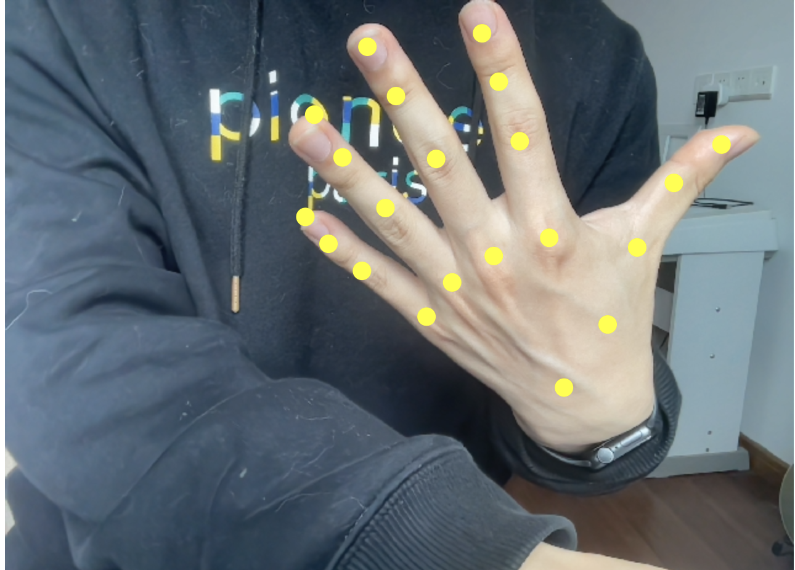
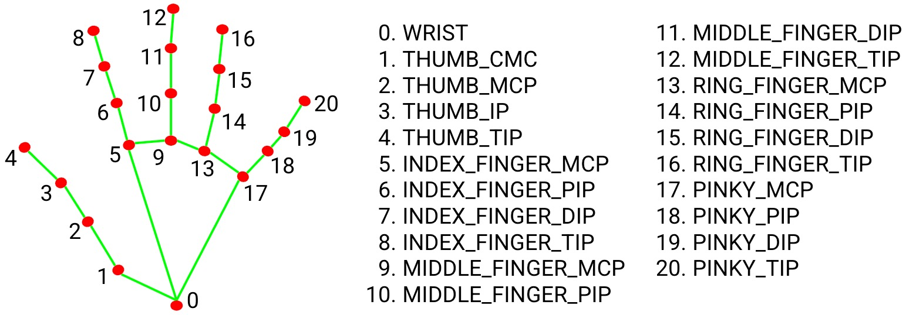
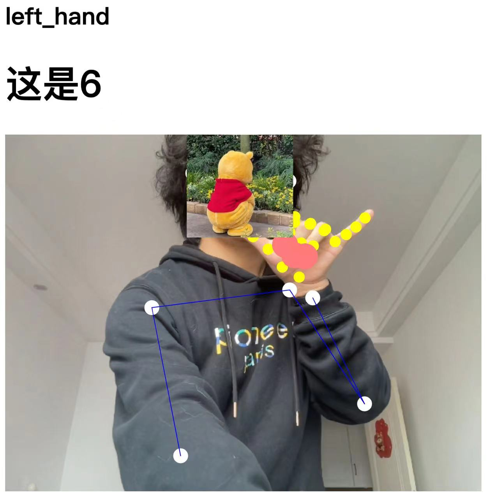
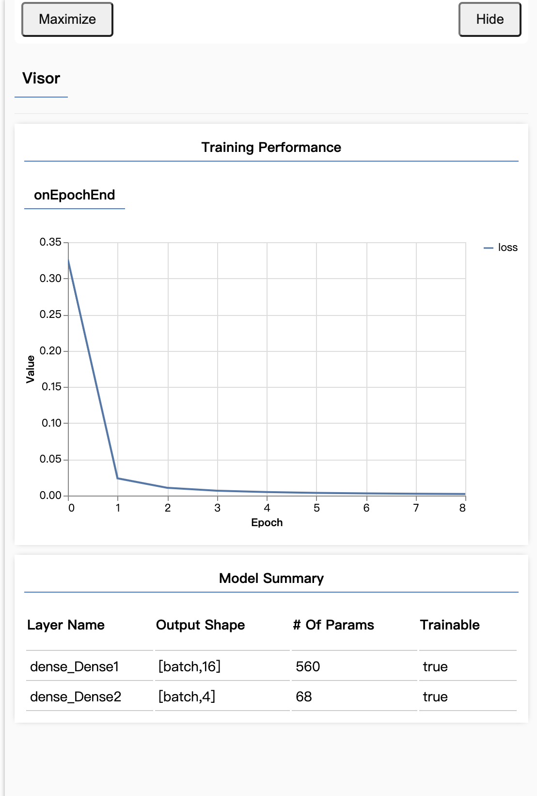

# Pose-Detection Demos in Web

**Author : Primo**

This package involves some demos I collected that using state-of-the-art models for running real-time pose detection
in your browser.

*Hint: Since most of models in the package are trained by Google,make sure that you are able to bypass the GFW.*

Before we start, let's give a brief introduction to the principle of pose-detection technology in web browsers.
<br>

Above all, every ingenious effect achievement in this package is realized by machine learning.In brief, machine learning is a method that you make the computer understand something by teaching it something.You tell the computer that 'A' is 'A' and "B" isn't 'A' many many many times by delivering countless data to the computer,and we call it 'Dataset'.Then the computer will learn the *Dataset* via some algorithms.After the learning process, if you give the computer some information,it will classify them.And then it can tell you "A" is  "A' with a great probability.
<div align="center">

</div>

These days, we have many platforms to  create machine learning models.**Tensorflow(Google)** and **Pytorch(Facebook/Meta)** are popular ones among them.Both of them require **Python** skills to create and apply models.To **Digital Art Designers/Game Developers/Software Engineers(especially Front-End Engineers)** who do not have enough mathematic and Python-Programming skills,nevertheless,those platforms have steep learning curve.

To make machine-learning skills easier for developers,Google released a Javascript library **Tensorflow.js**.It makes it possible for us to create machine learning models in Javascript or in another word,in Web.Meanwhile,Node.JS is also available.Since web is so convenient that we can use it on almost every console.And we can 'Code once,run everywhere'.

To simplify the process further,we got **ML5.JS**.It is derived from tensorflow.js and relies heavily on **P5.JS** which is another JS library (processing in the web).So you can consider that both ML5.JS and P5.JS are designed for we digital-art students or someone(newbie) who is interested in the application of AI.

### 01-Posenet in P5.js

Tensorflow.js provides 3 kinds of pose-detection models:**MoveNet, Blazepose and Posenet**.They're trained by different research teams in Google.
In ML5.js, we use the **Posenet** model.

**Posenet** is trained by the dataset <a href="https://paperswithcode.com/dataset/coco">"COCO"</a>((Microsoft Common Objects in Context)).It is a large-scale object detection, segmentation, key-point detection, and captioning dataset. The dataset consists of 328K images.

As a result ,in **Posenet** ,we got a keypoint diagram called *COCO Keypoints*,and so does it in **Movenet**.

<div align="center">
    
</div>

The data will be reserved in an array, and their index are:
```json
0: nose
1: left_eye
2: right_eye
3: left_ear
4: right_ear
5: left_shoulder
6: right_shoulder
7: left_elbow
8: right_elbow
9: left_wrist
10: right_wrist
11: left_hip
12: right_hip
13: left_knee
14: right_knee
15: left_ankle
16: right_ankle
```

In ML5.JS,once we detect a "pose" from the image or video, we got an object.First, it has a score stands for the confidence score.Then we got an array called "keypoints".
The 17 points are reserved in the order above in this array,and every point has a score,'part' and a position coordinate.For the coordinate,x and y represent the **actual keypoint position** in the image,which is different from that in **Blazepose**.Besides the array,each part is stored in the object,so if you want to know the x index of "nose",just use **let x=pose.nose.x**.
```json
{
    "score": 0.36062840477782576,
    "keypoints": [
        {
            "score": 0.9998100399971008,
            "part": "nose",
            "position": {
                "x": 304.9208122283104,
                "y": 309.5389037373465
            }
        },
        {
            "score": 0.9993601441383362,
            "part": "leftEye",
            "position": {
                "x": 350.35096105434553,
                "y": 267.1330611529517
            }
        },
        {
            "score": 0.9985820055007935,
            "part": "rightEye",
            "position": {
                "x": 278.3887003367977,
                "y": 259.3134281143604
            }
        },
        {
            "score": 0.8186571002006531,
            "part": "leftEar",
            "position": {
                "x": 397.34817979864573,
                "y": 290.57919038408926
            }
        },
        {
            "score": 0.4284822642803192,
            "part": "rightEar",
            "position": {
                "x": 235.44428754873314,
                "y": 282.58995798311344
            }
        },
        {
            "score": 0.8433191776275635,
            "part": "leftShoulder",
            "position": {
                "x": 471.59480588445405,
                "y": 496.9624085185129
            }
        },
        {
            "score": 0.9728891253471375,
            "part": "rightShoulder",
            "position": {
                "x": 154.78833803406948,
                "y": 479.0577168594539
            }
        },
        {
            "score": 0.0226301196962595,
            "part": "leftElbow",
            "position": {
                "x": 529.4033742229299,
                "y": 585.576703854572
            }
        },
        {
            "score": 0.017581390216946602,
            "part": "rightElbow",
            "position": {
                "x": 34.78550595532132,
                "y": 580.9919186603234
            }
        },
        {
            "score": 0.0062744165770709515,
            "part": "leftWrist",
            "position": {
                "x": 512.406827577821,
                "y": 553.6286341448239
            }
        },
        {
            "score": 0.002704796614125371,
            "part": "rightWrist",
            "position": {
                "x": 76.06921570774182,
                "y": 557.3660603293185
            }
        },
        {
            "score": 0.00424220459535718,
            "part": "leftHip",
            "position": {
                "x": 398.1407143077034,
                "y": 564.717056927514
            }
        },
        {
            "score": 0.00541426008567214,
            "part": "rightHip",
            "position": {
                "x": 240.92917965543873,
                "y": 555.8058724607475
            }
        },
        {
            "score": 0.0022254108916968107,
            "part": "leftKnee",
            "position": {
                "x": 400.528016146055,
                "y": 551.4891182866078
            }
        },
        {
            "score": 0.0033826844301074743,
            "part": "rightKnee",
            "position": {
                "x": 184.80833773483099,
                "y": 543.0382065828672
            }
        },
        {
            "score": 0.002814995124936104,
            "part": "leftAnkle",
            "position": {
                "x": 386.2246680352475,
                "y": 550.1599762319127
            }
        },
        {
            "score": 0.002312745898962021,
            "part": "rightAnkle",
            "position": {
                "x": 152.1527099609375,
                "y": 543.721379974009
            }
        }
    ],
    "nose": {
        "x": 304.9208122283104,
        "y": 309.5389037373465,
        "confidence": 0.9998100399971008
    },
    "leftEye": {
        "x": 350.35096105434553,
        "y": 267.1330611529517,
        "confidence": 0.9993601441383362
    },
    "rightEye": {
        "x": 278.3887003367977,
        "y": 259.3134281143604,
        "confidence": 0.9985820055007935
    },
    "leftEar": {
        "x": 397.34817979864573,
        "y": 290.57919038408926,
        "confidence": 0.8186571002006531
    },
    "rightEar": {
        "x": 235.44428754873314,
        "y": 282.58995798311344,
        "confidence": 0.4284822642803192
    },
    "leftShoulder": {
        "x": 471.59480588445405,
        "y": 496.9624085185129,
        "confidence": 0.8433191776275635
    },
    "rightShoulder": {
        "x": 154.78833803406948,
        "y": 479.0577168594539,
        "confidence": 0.9728891253471375
    },
    "leftElbow": {
        "x": 529.4033742229299,
        "y": 585.576703854572,
        "confidence": 0.0226301196962595
    },
    "rightElbow": {
        "x": 34.78550595532132,
        "y": 580.9919186603234,
        "confidence": 0.017581390216946602
    },
    "leftWrist": {
        "x": 512.406827577821,
        "y": 553.6286341448239,
        "confidence": 0.0062744165770709515
    },
    "rightWrist": {
        "x": 76.06921570774182,
        "y": 557.3660603293185,
        "confidence": 0.002704796614125371
    },
    "leftHip": {
        "x": 398.1407143077034,
        "y": 564.717056927514,
        "confidence": 0.00424220459535718
    },
    "rightHip": {
        "x": 240.92917965543873,
        "y": 555.8058724607475,
        "confidence": 0.00541426008567214
    },
    "leftKnee": {
        "x": 400.528016146055,
        "y": 551.4891182866078,
        "confidence": 0.0022254108916968107
    },
    "rightKnee": {
        "x": 184.80833773483099,
        "y": 543.0382065828672,
        "confidence": 0.0033826844301074743
    },
    "leftAnkle": {
        "x": 386.2246680352475,
        "y": 550.1599762319127,
        "confidence": 0.002814995124936104
    },
    "rightAnkle": {
        "x": 152.1527099609375,
        "y": 543.721379974009,
        "confidence": 0.002312745898962021
    }
}
```

### 02-Handpose in P5.js
<div align="center">
    
</div>
Handpose is a machine-learning model that allows for palm detection and hand-skeleton finger tracking in the browser. It can detect a maximum of one hand at a time and provides 21 3D hand keypoints that describe important locations on the palm and fingers.
<div align="center">
    
</div>

Just like  **Posenet** ,we will get an object from the serve after detecting the hand.
Firstly,the model has an array which stores the coordinate of 21 keypoints of hand above in order.
Pay attention that every coordinate has three values [x,y,z]. [x,y] stands for the location of the point in the 2-D plane, and z is the number of z-index means you can use it in the 3-D space. 

Besides the array we have an object in the object called 'annotations'.It stores every finger's information.
So if you want query the information of 'thumb',**let thumb=object.annotations.thumb**

```json
{
    "thumb": [
        [
            311.1474129357343,
            392.8839134580602,
            31.628944396972656
        ],
        [
            305.308736143059,
            365.20717624808134,
            40.958133697509766
        ],
        [
            296.55928350326406,
            344.6487949195921,
            42.178436279296875
        ],
        [
            289.09028835985714,
            321.9771320066599,
            41.17280578613281
        ]
    ],
    "indexFinger": [
        [
            351.26226986601506,
            315.317770126479,
            33.45431900024414
        ],
        [
            317.7573958881063,
            287.82946656887157,
            41.258514404296875
        ],
        [
            301.0551201111043,
            279.13742066547405,
            45.38811111450195
        ],
        [
            295.82737357654224,
            276.7010123385984,
            46.33940887451172
        ]
    ],
    "middleFinger": [
        [
            353.7122101313199,
            309.04347842173087,
            16.16316032409668
        ],
        [
            294.2536349253059,
            291.90549768414684,
            24.071781158447266
        ],
        [
            277.4029452280277,
            312.1420227467726,
            23.412212371826172
        ],
        [
            282.40719597599997,
            328.68568506297936,
            20.75050163269043
        ]
    ],
    "ringFinger": [
        [
            343.6278986695346,
            307.76669737200876,
            1.2318196296691895
        ],
        [
            281.3661445784785,
            301.97755074942916,
            9.658766746520996
        ],
        [
            269.26558032780065,
            333.03373573840565,
            8.836081504821777
        ],
        [
            278.37322912437753,
            350.7239374751061,
            4.151844024658203
        ]
    ],
    "pinky": [
        [
            327.2987480246994,
            307.3400266338206,
            -11.768608093261719
        ],
        [
            281.79613233056017,
            306.4856480945225,
            -2.7679641246795654
        ],
        [
            274.7228580919318,
            333.18432280186977,
            -1.2925504446029663
        ],
        [
            287.3491935974832,
            347.7520597512496,
            -4.416280746459961
        ]
    ],
    "palmBase": [
        [
            333.42525789734873,
            414.1195342209028,
            -0.0014080926775932312
        ]
    ]
}
```

### 03-Handpose+Posenet in P5.js

<div align="center">

</div>

Now we can combine the two models together.So we can get both pose data and one hand's data.
With this data, we can make some simple classifications.
The demo written by me can recognize which hand is detecting,by comparing the **distance of palm(Handpose) and Wrist(Posenet)**.

And, we can make use of the coordinate of every finger to judge if it is bent.If it is bent,the circle of this finger in the image will turn red.
We are able to recognize some gestures like '1,2,3,4,5,6' via counting which finger is bent,without machine learning algorithms.


### 04-train_own_model

Despite computing coordinates by their positional relationship,you can also use machine learning skills to classify a gesture.

In ml5.js,it's not very difficult for us to train our own models.

I've written a demo in <a src="./04-train-own_model">04-train-own_model</a>.

The model can train 4 different gestures.If you want to train more models,find all the 'options' in all javascript documents and change the 'output' number to whatever you want.

First,open the 'collect' document.Press any button on your keyboard except 's'.And then you will see the 'waiting' on the screen turns to 'ready'.You need to get ready to show your gestures in front your webcams.Then 'ready' will turn to 'collecting'.
The program starts to collect your body's data.

Then the word will trun to 'waiting' again,you are able to press another key.After you've pressed 4 keys (or the number you want),press 'S' and you will get a JSON document that stores the data.

Rename the JSON file and drag it to the file 'train'.

Change your root to 'train' , open the 'index.js'.In line 12,change the json file's name to what you've just renamed it.And then run the HTML file.The model will be training.

<div align="center">

</div>

Wait a minute,and you will get three files.

Change your root to "classify" folder.And put those files in the folder "model".

Run the HTML file, and make some poses.The computer is able to classify the pose by models your trained!